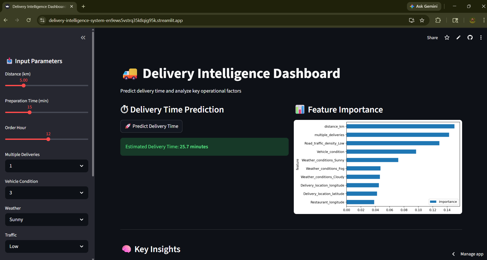
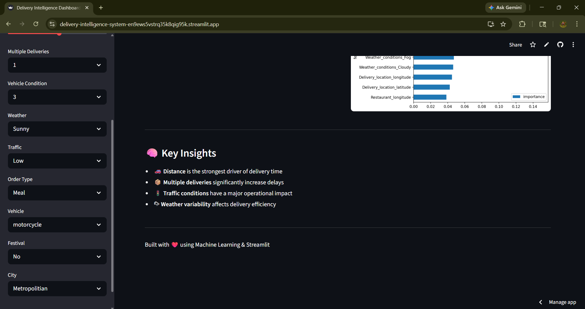

# 🚚 Delivery Intelligence Dashboard

An end-to-end **product analytics + machine learning system** that predicts delivery time and uncovers key operational bottlenecks using real-world logistics data.

---

## 🌐 Live Demo
🔗 (https://delivery-intelligence-system-en9ews5vstrq35k8qig95k.streamlit.app/)

---

## 📌 Problem Statement

Last-mile delivery performance is influenced by multiple dynamic factors such as traffic, batching, weather, and distance.  
This project aims to:

- Predict delivery time accurately  
- Identify key drivers of delays  
- Enable **data-driven operational decisions**

---

## 🚀 Features

- ⏱ **Delivery Time Prediction** using ML (~4.5 min MAE)  
- 🎛 **Interactive Dashboard** for real-time scenario simulation  
- 📊 **Feature Importance Analysis** to understand key drivers  
- 🧠 **Insights Layer** with quantified operational impact  
- 📦 Supports multiple delivery conditions (traffic, batching, weather, etc.)

---

## 🧠 Key Insights

- 🚦 High traffic increases delivery time by **~28%**  
- 📦 Batching 2 orders increases delivery time by **~77%**  
- 🌦 Fog and cloudy conditions lead to higher delays  
- ⏱ Most deliveries fall within a **20–30 min range**

---

## 🛠 Tech Stack

- **Frontend:** Streamlit  
- **Backend:** Python  
- **ML Model:** Random Forest Regressor  
- **Data Processing:** Pandas, NumPy  
- **Visualization:** Matplotlib  

---

## 🧩 System Architecture

User Input (UI)
      ↓
Preprocessing (Feature Engineering)
      ↓
Model (Random Forest)
      ↓
Prediction Output + Insights

## 📂 Project Structure
```
delivery-intelligence/
│
├── app.py                  # Streamlit app
├── requirements.txt
│
├── data/
│   └── delivery_data.csv
│
└── src/
    ├── preprocess.py       # Data cleaning & feature engineering
    ├── train.py            # Model training & feature importance
    └── predict.py          # Prediction pipeline

```
## ⚙️ Installation & Setup
# Clone the repo
git clone https://github.com/your-username/delivery-intelligence.git

cd delivery-intelligence

# Create virtual environment
python -m venv venv
source venv/bin/activate   # Windows: venv\Scripts\activate

# Install dependencies
pip install -r requirements.txt

# Run the app
streamlit run app.py

# 📸 Screenshots

### 🔹 Dashboard Overview


### 🔹 Prediction Interface

